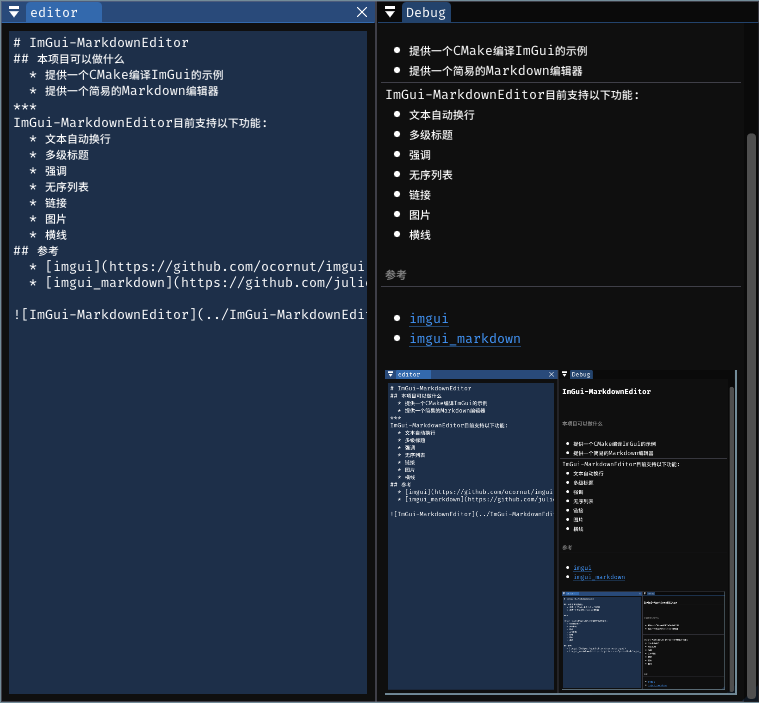

# ImGui-MarkdownEditor

## 本项目可以做什么

   * 提供一个CMake编译ImGui的示例
   * 提供一个简易的Markdown编辑器

## 示例


```markdown
# ImGui-MarkdownEditor

## 本项目可以做什么

   * 提供一个CMake编译ImGui的示例
   * 提供一个简易的Markdown编辑器

***
ImGui-MarkdownEditor 目前支持以下功能：

  * 文本自动换行
  * 多级标题
  * 强调
  * 无序列表
  * 链接
  * 图片
  * 横线

## 参考
  * [imgui](https://github.com/ocornut/imgui)
  * [imgui_markdown](https://github.com/juliettef/imgui_markdown)


```
## 支持的语法

### 标题
```
# H1
## H2
### H3
```
### 强调
```
*emphasis*
_emphasis_
**strong emphasis**
__strong emphasis__
```
### 无序列表
```
Normal text
··*·Unordered List level 1
····*·Unordered List level 2
······*·Unordered List level 3
······*·Unordered List level 3
··*·Unordered List level 1
Normal text
```
### 链接
```
[link description](https://...)
```
### 图片
```

```
### 横线
```
***
```

## 参考
[imgui](https://github.com/ocornut/imgui)
[imgui_markdown](https://github.com/juliettef/imgui_markdown)


## 相较于imgui_markdown的改动
  * 添加了linux下链接打开方式
  * 完善了显示图片的功能
  * 添加了字体设置一些不重要的功能
